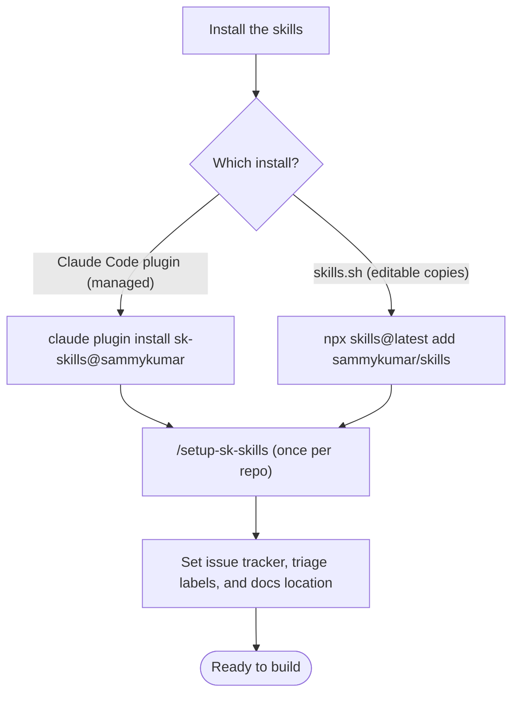
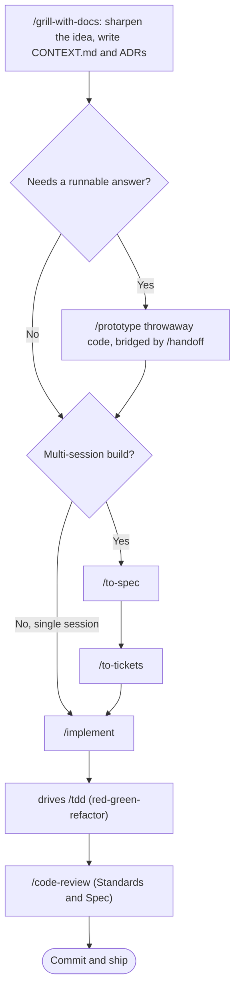

# Skills For Real Engineers

[](https://skills.sh/sammykumar/skills)

My agent skills that I use every day to do real engineering - not vibe coding.

Developing real applications is hard. Approaches like GSD, BMAD, and Spec-Kit try to help by owning the process. But while doing so, they take away your control and make bugs in the process hard to resolve.

These skills are designed to be small, easy to adapt, and composable. They work with any model. They're based on decades of engineering experience. Hack around with them. Make them your own. Enjoy.

This repo began as a fork of [mattpocock/skills](https://github.com/mattpocock/skills) and is maintained independently by SK Productions. See [`.agents/adr/0004-fork-break-off-as-sk-skills.md`](./.agents/adr/0004-fork-break-off-as-sk-skills.md) for what changed.

## Installation (30-second setup)

Two ways in, two philosophies. **The [Claude Code plugin](https://code.claude.com/docs/en/plugins)** installs the whole set as a managed, read-only bundle you subscribe to rather than fork. **[skills.sh](https://skills.sh/sammykumar/skills)** copies editable skill files into your project, so you can hack on them and make them your own. Pick one: installing both leaves you with every skill twice.

### 1. Get the skills

<details>
<summary><strong>Claude Code</strong></summary>

```bash
claude plugin marketplace add sammykumar/skills
claude plugin install sk-skills@sammykumar
```

Or, from inside a session:

```
/plugin marketplace add sammykumar/skills
/plugin install sk-skills@sammykumar
```

It ships from this repo's own marketplace, so add the marketplace first, then install. To pull later updates, re-run the install or `/plugin marketplace update sammykumar`.

</details>

<details>
<summary><strong>Codex, and other agents</strong></summary>

```bash
npx skills@latest add sammykumar/skills
```

Pick the skills you want, and which coding agents to install them on. **The installer lets you choose which skills to take: make sure `setup-sk-skills` and `update-sk-skills` are both among them.**

A native Codex plugin is on the roadmap (see [`.agents/adr/0002-ship-as-a-claude-code-plugin.md`](./.agents/adr/0002-ship-as-a-claude-code-plugin.md)).

</details>

<details>
<summary><strong>For tinkerers</strong></summary>

Use the same installer, on any agent, including Claude Code:

```bash
npx skills@latest add sammykumar/skills
```

It writes the skills into your repo as ordinary files you own and can edit. Nothing updates behind your back; pull the latest changes when you want them by running `/update-sk-skills`.

</details>

### 2. Run `/setup-sk-skills`

In your agent, run it once per repo. It will:

- Ask you which issue tracker you want to use (GitHub, Linear, or Repo PDD Markdown)
- Ask you what labels you apply to tickets when you triage them (`/triage` uses labels)
- Ask you where you want to save any docs we create
- Offer to mine your past sessions in that repo for the words you actually use, and seed `CONTEXT.md` with the terms you confirm

### 3. Bam - you're ready to go.

### Keeping them up to date

Run `/update-sk-skills`. It detects how the skills were installed on this machine (plugin, skills.sh, or a dev checkout) and runs the matching update, rather than assuming a route from the harness you happen to be in.


## Onboarding a repo

Install the skills one of two ways, then run [`/setup-sk-skills`](./skills/engineering/setup-sk-skills/SKILL.md) once to point them at your issue tracker, triage labels, and docs location, and to seed your glossary from past sessions.



## Building a new feature

Start every change with a grilling session, then either implement it directly or split it into tickets first. [`/implement`](./skills/engineering/implement/SKILL.md) drives [`/tdd`](./skills/engineering/tdd/SKILL.md) internally and closes out with [`/code-review`](./skills/engineering/code-review/SKILL.md) before committing.



Want the whole route driven for you? [`/auto-implement <feature>`](./skills/engineering/auto-implement/SKILL.md) walks this diagram end to end from a feature you name up front: it grills, records the design, then either builds it here or splits it into tickets and hands them back. It stops before building the tickets, because each one wants its own fresh context window.

Forget which skill fits a given moment? [`/ask-sk`](./skills/engineering/ask-sk/SKILL.md) is the router over all of these. For an effort too big to hold in one session, start at [`/wayfinder`](./skills/engineering/wayfinder/SKILL.md), which charts a map of decision tickets before handing off to `/to-spec`.

## Reference

These split on two axes. **Bucket**: engineering skills are for daily code work, productivity skills are general workflow tools not tied to code. **Invocation**: who can invoke them. **User-invoked** skills are reachable only when you type them (e.g. `/grill-me`); their job is to orchestrate. **Model-invoked** skills can be invoked by you _or_ reached for automatically by the agent when the task fits; they hold the reusable discipline. A user-invoked skill may invoke model-invoked skills, but never another user-invoked one.

| Skill | Bucket | Invocation | What it does |
| --- | --- | --- | --- |
| **[ask-sk](./skills/engineering/ask-sk/SKILL.md)** | Engineering | User-invoked | Ask which skill or flow fits your situation. A router over the user-invoked skills in this repo. |
| **[auto-implement](./skills/engineering/auto-implement/SKILL.md)** | Engineering | User-invoked | Drive the whole idea-to-ship flow on a feature you name up front: grill it, record the design, then either build it here in one session or split it into tickets and hand them back. |
| **[grill-with-docs](./skills/engineering/grill-with-docs/SKILL.md)** | Engineering | User-invoked | Grilling session that also documents as it goes: sharpening terminology in `CONTEXT.md`, recording hard decisions as ADRs, and writing the resolved design into your repo's planning-doc location. |
| **[triage](./skills/engineering/triage/SKILL.md)** | Engineering | User-invoked | Move issues through a state machine of triage roles. |
| **[improve-codebase-architecture](./skills/engineering/improve-codebase-architecture/SKILL.md)** | Engineering | User-invoked | Scan a codebase for deepening opportunities, present them as a visual HTML report, then grill through whichever one you pick. |
| **[setup-sk-skills](./skills/engineering/setup-sk-skills/SKILL.md)** | Engineering | User-invoked | Configure this repo for the engineering skills (issue tracker, triage labels, domain doc layout), and seed `CONTEXT.md` from the vocabulary in your past sessions. Run once per repo before using the other engineering skills. |
| **[update-sk-skills](./skills/engineering/update-sk-skills/SKILL.md)** | Engineering | User-invoked | Update the skills on this machine, after detecting how they were actually installed: the Claude Code plugin, skills.sh, or a dev checkout. |
| **[to-spec](./skills/engineering/to-spec/SKILL.md)** | Engineering | User-invoked | Turn the current conversation into a spec and publish it to the issue tracker. No interview, just synthesizes what you've already discussed. |
| **[to-tickets](./skills/engineering/to-tickets/SKILL.md)** | Engineering | User-invoked | Break any plan, spec, or conversation into a set of tracer-bullet tickets, each declaring its blocking edges, written as text in a local file, or as native blocking links on a real tracker. |
| **[implement](./skills/engineering/implement/SKILL.md)** | Engineering | User-invoked | Build the work described by a spec or set of tickets, driving `/tdd` at pre-agreed seams and closing out with `/code-review` before committing. |
| **[wayfinder](./skills/engineering/wayfinder/SKILL.md)** | Engineering | User-invoked | Plan a huge chunk of work, more than one agent session can hold, as a shared map of decision tickets on the issue tracker, and resolve them one at a time until the way to the destination is clear. |
| **[prototype](./skills/engineering/prototype/SKILL.md)** | Engineering | Model-invoked | Build a throwaway prototype to answer a design question, either a single shareable HTML file for state/logic questions, or several radically different UI variations toggleable from one route. |
| **[diagnosing-bugs](./skills/engineering/diagnosing-bugs/SKILL.md)** | Engineering | Model-invoked | Disciplined diagnosis loop for hard bugs and performance regressions: build a feedback loop that goes red on this bug → minimise → hypothesise → instrument → fix → regression-test. |
| **[research](./skills/engineering/research/SKILL.md)** | Engineering | Model-invoked | Investigate a question against high-trust primary sources and capture the findings as a cited Markdown file in the repo, run as a background agent. |
| **[tdd](./skills/engineering/tdd/SKILL.md)** | Engineering | Model-invoked | Test-driven development with a red-green-refactor loop. Builds features or fixes bugs one vertical slice at a time. |
| **[domain-modeling](./skills/engineering/domain-modeling/SKILL.md)** | Engineering | Model-invoked | Actively build and sharpen a project's domain model: challenge terms against the glossary, stress-test with edge-case scenarios, and update `CONTEXT.md` and ADRs inline. |
| **[codebase-design](./skills/engineering/codebase-design/SKILL.md)** | Engineering | Model-invoked | Shared discipline and vocabulary for designing deep modules: a lot of behaviour behind a small interface, placed at a clean seam, testable through that interface. |
| **[code-review](./skills/engineering/code-review/SKILL.md)** | Engineering | Model-invoked | Two-axis review of the diff since a fixed point: **Standards** (does it follow the repo's coding standards, plus a Fowler smell baseline?) and **Spec** (does it faithfully implement the originating issue/spec?), run as parallel sub-agents so neither pollutes the other. |
| **[resolving-merge-conflicts](./skills/engineering/resolving-merge-conflicts/SKILL.md)** | Engineering | Model-invoked | Work through an in-progress git merge or rebase conflict hunk by hunk, resolving by intent traced to each side's primary source, then finish the operation (never `--abort`). |
| **[writing-specs](./skills/engineering/writing-specs/SKILL.md)** | Engineering | Model-invoked | Synthesize the current conversation into a spec and publish it to the project issue tracker. The engine under `/to-spec`. |
| **[splitting-tickets](./skills/engineering/splitting-tickets/SKILL.md)** | Engineering | Model-invoked | Break a plan, spec, or conversation into tracer-bullet tickets with their blocking edges, published to the configured tracker. The engine under `/to-tickets`. |
| **[recording-designs](./skills/engineering/recording-designs/SKILL.md)** | Engineering | Model-invoked | Write the resolved design record into whatever planning-doc convention the repo already uses. The engine `/grill-with-docs` and `/auto-implement` share. |
| **[wizard](./skills/engineering/wizard/SKILL.md)** | Engineering | Model-invoked | Generate an interactive bash wizard that walks a human through steps only they can perform: provisioning infrastructure, setting up credentials or CI secrets, walking an unfamiliar third-party dashboard, or running a one-off migration or cutover. |
| **[figma-arch-diagram](./skills/engineering/figma-arch-diagram/SKILL.md)** | Engineering | Model-invoked | Build or update an architecture, tech-stack, networking, or data-flow diagram on a FigJam board from the "Icon Lib - Editable" component library: authored as a spec, laid out by a tested engine, emitted by component key, then verified on the rendered board. |
| **[openscad-lsp](./skills/engineering/openscad-lsp/SKILL.md)** | Engineering | Model-invoked | What the OpenSCAD language server wired into this plugin can and cannot answer, so a guess never gets presented as a resolved symbol: cross-file go-to-definition works, find references does not exist, rename is single-file, and diagnostics are syntax only. |
| **[grill-me](./skills/productivity/grill-me/SKILL.md)** | Productivity | User-invoked | Get relentlessly interviewed about a plan or design until every branch of the design tree is resolved. |
| **[handoff](./skills/productivity/handoff/SKILL.md)** | Productivity | User-invoked | Compact the current conversation into a handoff document so another agent can continue the work. |
| **[teach](./skills/productivity/teach/SKILL.md)** | Productivity | User-invoked | Teach the user a new skill or concept over multiple sessions, using the current directory as a stateful teaching workspace. |
| **[to-questionnaire](./skills/productivity/to-questionnaire/SKILL.md)** | Productivity | User-invoked | Turn a decision you can't answer alone into a Markdown questionnaire for the one person who can, filled in async, or together over a meeting. It grills you about the send (who it's for, what you need back), not the subject. |
| **[wait-what](./skills/productivity/wait-what/SKILL.md)** | Productivity | User-invoked | Fire this the moment a message doesn't land. The agent re-pitches it with the context you're missing, in plain English, using your `CONTEXT.md` vocabulary. |
| **[grilling](./skills/productivity/grilling/SKILL.md)** | Productivity | Model-invoked | Interview the user relentlessly about a plan, decision, or idea until every branch of the design tree is resolved. The reusable interview primitive behind `grill-me`, `grill-with-docs`, `auto-implement`, `triage`, `wayfinder` and `improve-codebase-architecture`. |
| **[writing-for-agents](./skills/productivity/writing-for-agents/SKILL.md)** | Productivity | Model-invoked | Writing documents for agents: skills, AGENTS.md/CLAUDE.md, and any doc an agent reaches by a pointer. |

## Why These Skills Exist

I built these skills as a way to fix common failure modes I see with Claude Code, Codex, and other coding agents.

### #1: The Agent Didn't Do What I Want

> "No-one knows exactly what they want"
>
> David Thomas & Andrew Hunt, [The Pragmatic Programmer](https://www.amazon.co.uk/Pragmatic-Programmer-Anniversary-Journey-Mastery/dp/B0833F1T3V)

**The Problem**. The most common failure mode in software development is misalignment. You think the dev knows what you want. Then you see what they've built - and you realize it didn't understand you at all.

This is just the same in the AI age. There is a communication gap between you and the agent. The fix for this is a **grilling session** - getting the agent to ask you detailed questions about what you're building.

**The Fix** is to use:

- [`/grill-me`](./skills/productivity/grill-me/SKILL.md) - for non-code uses
- [`/grill-with-docs`](./skills/engineering/grill-with-docs/SKILL.md) - same as [`/grill-me`](./skills/productivity/grill-me/SKILL.md), but adds more goodies (see below)

These are my most popular skills. They help you align with the agent before you get started, and think deeply about the change you're making. Use them _every_ time you want to make a change.

### #2: The Agent Is Way Too Verbose

> With a ubiquitous language, conversations among developers and expressions of the code are all derived from the same domain model.
>
> Eric Evans, [Domain-Driven-Design](https://www.amazon.co.uk/Domain-Driven-Design-Tackling-Complexity-Software/dp/0321125215)

**The Problem**: At the start of a project, devs and the people they're building the software for (the domain experts) are usually speaking different languages.

I felt the same tension with my agents. Agents are usually dropped into a project and asked to figure out the jargon as they go. So they use 20 words where 1 will do.

**The Fix** for this is a shared language. It's a document that helps agents decode the jargon used in the project.

<details>
<summary>
Example
</summary>

Here's an example `CONTEXT.md`. Which one is easier to read?

- **BEFORE**: "There's a problem when a lesson inside a section of a course is made 'real' (i.e. given a spot in the file system)"
- **AFTER**: "There's a problem with the materialization cascade"

This concision pays off session after session.

</details>

This is built into [`/grill-with-docs`](./skills/engineering/grill-with-docs/SKILL.md). It's a grilling session, but that helps you build a shared language with the AI, and document hard-to-explain decisions in ADR's.

It's hard to explain how powerful this is. It might be the single coolest technique in this repo. Try it, and see.

> [!TIP]
> A shared language has many other benefits than reducing verbosity:
>
> - **Variables, functions and files are named consistently**, using the shared language
> - As a result, the **codebase is easier to navigate** for the agent
> - The agent also **spends fewer tokens on thinking**, because it has access to a more concise language

### #3: The Code Doesn't Work

> "Always take small, deliberate steps. The rate of feedback is your speed limit. Never take on a task that’s too big."
>
> David Thomas & Andrew Hunt, [The Pragmatic Programmer](https://www.amazon.co.uk/Pragmatic-Programmer-Anniversary-Journey-Mastery/dp/B0833F1T3V)

**The Problem**: Let's say that you and the agent are aligned on what to build. What happens when the agent _still_ produces crap?

It's time to look at your feedback loops. Without feedback on how the code it produces actually runs, the agent will be flying blind.

**The Fix**: You need the usual tranche of feedback loops: static types, browser access, and automated tests.

For automated tests, a red-green-refactor loop is critical. This is where the agent writes a failing test first, then fixes the test. This helps give the agent a consistent level of feedback that results in far better code.

I've built a **[`/tdd`](./skills/engineering/tdd/SKILL.md) skill** you can slot into any project. It encourages red-green-refactor and gives the agent plenty of guidance on what makes good and bad tests.

For debugging, I've also built a **[`/diagnosing-bugs`](./skills/engineering/diagnosing-bugs/SKILL.md)** skill that wraps best debugging practices into a disciplined loop, gated phase by phase.

### #4: We Built A Ball Of Mud

> "Invest in the design of the system _every day_."
>
> Kent Beck, [Extreme Programming Explained](https://www.amazon.co.uk/Extreme-Programming-Explained-Embrace-Change/dp/0321278658)

> "The best modules are deep. They allow a lot of functionality to be accessed through a simple interface."
>
> John Ousterhout, [A Philosophy Of Software Design](https://www.amazon.co.uk/Philosophy-Software-Design-2nd/dp/173210221X)

**The Problem**: Most apps built with agents are complex and hard to change. Because agents can radically speed up coding, they also accelerate software entropy. Codebases get more complex at an unprecedented rate.

**The Fix** for this is a radical new approach to AI-powered development: caring about the design of the code.

This is built in to every layer of these skills:

- [`/to-spec`](./skills/engineering/to-spec/SKILL.md) quizzes you about which modules you're touching before creating a spec

And crucially, [`/improve-codebase-architecture`](./skills/engineering/improve-codebase-architecture/SKILL.md) surveys a codebase for deepening opportunities and hands you the candidates. I recommend running it on your codebase once every few days. It is a survey, not a rescue: on a genuinely old codebase it will find real candidates, but it won't untangle the mud for you.

### Summary

Software engineering fundamentals matter more than ever. These skills are my best effort at condensing these fundamentals into repeatable practices, to help you ship the best apps of your career. Enjoy.